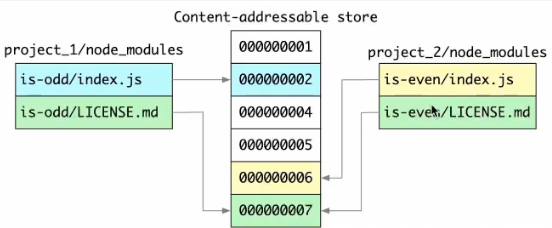

# language-mcp
一款对接多语言平台的 MCP

# 架构设计
参考了 vite-plugin-vue-mcp 的 `pnpm + monorepo` 的方案

## monorepo 常见的方案

### 包管理
- pnpm + workspace
- yarn + workspace
- lerna

### 构建缓存

### 增量构建

- nx
- turbo

## pnpm 的优势

中心化机制，解决依赖复用问题。

- 集中依赖管理，通过软链接的形式，避免重复安装依赖
  
- 安装并行提速机制
- 依赖扁平化，不存在循环依赖地狱结构

# engine
Node >= 22.12.0